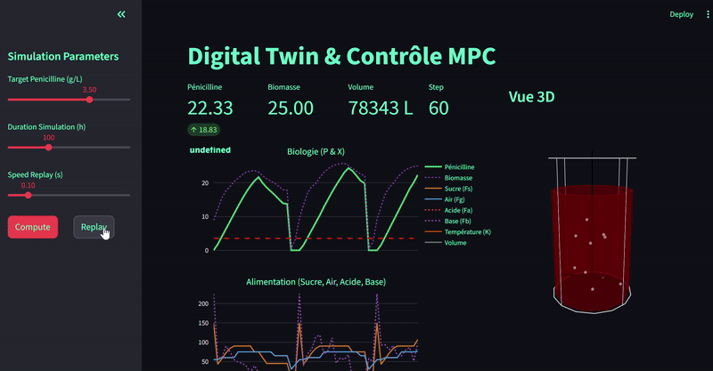
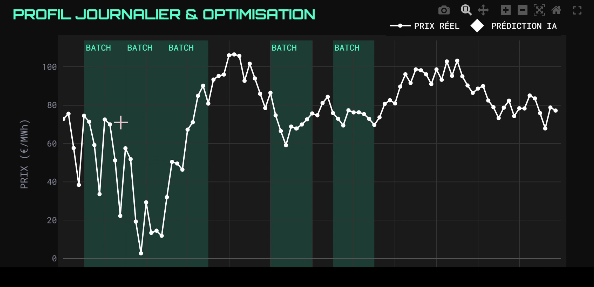
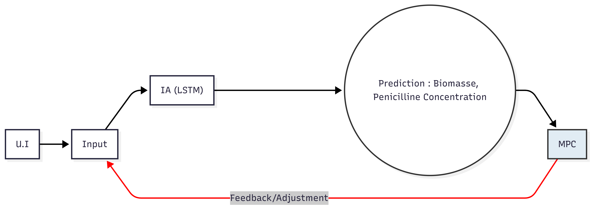

# ReaKt: Intelligent Bioreactor Autopilot

<div align="center">

  
  <br>
  <em>"React Smarter. ReaKt Faster."</em>
  <br>
  <br>

  <br><br>
</div>

---

## Overview

**ReaKt** is a next-generation control software designed to optimize industrial fermentation processes. Unlike traditional PID controllers that are reactive, ReaKt uses a **Predictive Closed-Loop** architecture.

It combines a **Deep Learning Digital Twin (LSTM)** to simulate biological dynamics and **Model Predictive Control (MPC)** to optimize inputs in real-time.

### Key Metrics
* **+23% Biomass Production** (Yield Optimization)
* **-17% Electricity Costs** (Smart Batch Planning)
* **70% Reduction** in manual supervision

<div align="center">
  
  <br>
</div>

---

## How It Works

<div align="center">
  
  <br>
</div>

ReaKt moves beyond "trial and error" by implementing a dual-engine architecture:

1.  **The Digital Twin (LSTM Neural Network):**
    * Trained on historical batch data to learn non-linear biological dynamics.
    * Predicts Penicillin ($P$) and Biomass ($X$) concentrations hours in advance based on current state and future control inputs.
    
2.  **The Strategist (Model Predictive Control - MPC):**
    * Solves a real-time optimization problem to determine the optimal sequence of control actions (Sugar Feed, Aeration, Temperature, pH).
    * Balances yield maximization against physical constraints and energy costs.

3.  **Continuous Learning:**
    * The system analyzes daily data at **11:59 PM** to fine-tune the LSTM weights, adapting to sensor drift or biological mutations automatically.

---

## Features & Interface

The project includes a full-stack **Streamlit** dashboard featuring:

* **3D Digital Twin Visualization:** A real-time, animated 3D bioreactor (Plotly) showing volume, agitation speed (RPM), aeration bubbles, and liquid color change based on biomass concentration.
* **Real-time Monitoring:** Live tracking of Key Performance Indicators (Penicillin, Biomass, Volume).
* **Interactive Replay:** A "DVR" mode to replay previous batches and analyze the MPC's decision-making process.
* **Process Charts:** Live plotting of control variables (Sugar, Air, Acid, Base) vs. Biological outputs.

---

## Dataset & Attribution

This project was trained and validated using the **IndPenSim** dataset, a benchmark for industrial penicillin fermentation.

**Source:**
> Goldrick, Stephen (2019), “100 Batches of IndPenSim V3”, Mendeley Data, V1.  
> **DOI:** [10.17632/npt257bjxn.1](https://data.mendeley.com/datasets/npt257bjxn/1)

We utilized the `100_Batches_IndPenSim_V3.csv` file to train the LSTM model on realistic industrial variables including:
* *Inputs:* Sugar feed rate ($F_s$), Aeration rate ($F_g$), Agitator power, Temperature, pH.
* *Outputs:* Penicillin concentration, Biomass concentration.

---

## Installation

### Prerequisites
* Python 3.8+
* PyTorch
* Streamlit
* Plotly

### Setup

1.  **Clone the repository**
    ```bash
    git clone git@github.com:Gab404/ReaKt.git
    cd reakt
    ```

2.  **Install dependencies**
    ```bash
    pip install -r requirements.txt
    ```

3.  **Download the Data**
    Download the dataset from [Mendeley Data](https://data.mendeley.com/datasets/npt257bjxn/1) and place `100_Batches_IndPenSim_V3.csv` in the `data/` folder.

4.  **Run the App**
    ```bash
    streamlit run app.py
    ```

---