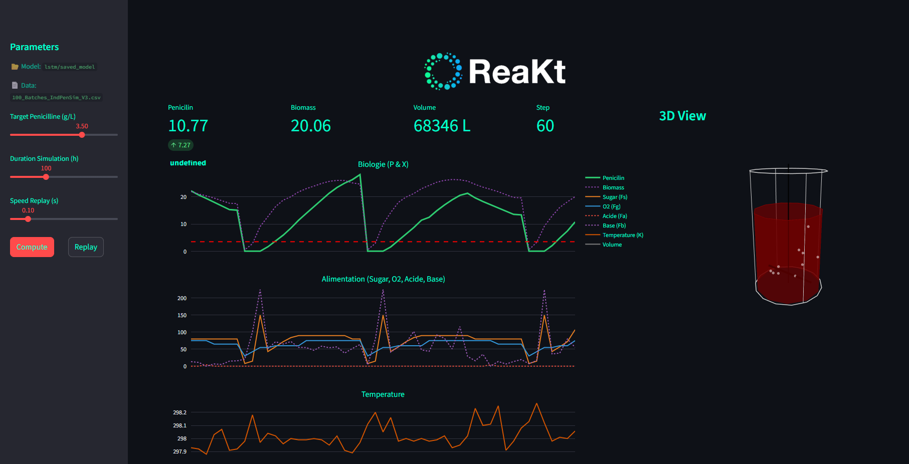
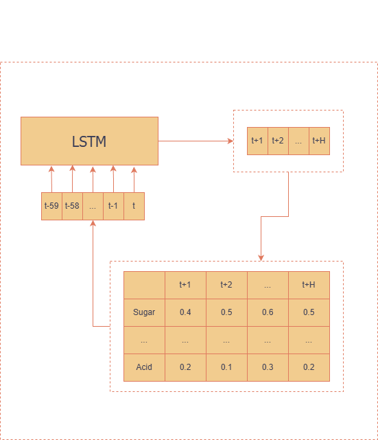
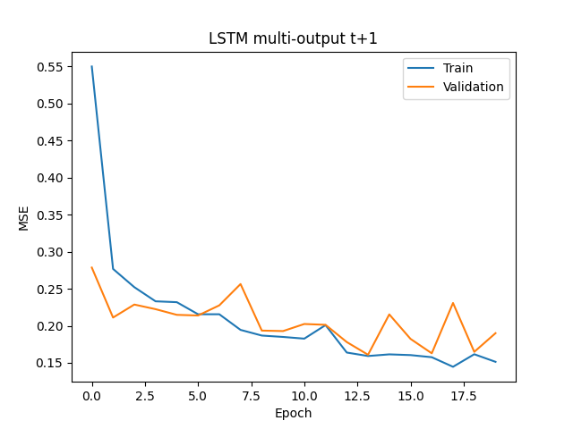
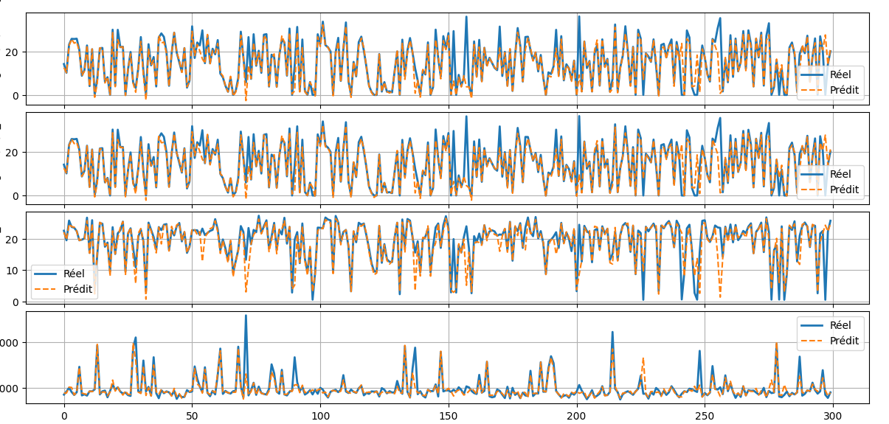

<div align="center">
  
  <br>
  <br>
</div>

# Virtual fermentation laboratory for smart autopilot
<div align="center">

  <br><br>
</div>

---

## Overview

**ReaKt** is a control software designed to optimize and simulate industrial fermentation processes. Unlike traditional PID controllers that are reactive, ReaKt uses a **Predictive Closed-Loop** architecture.

It combines a **Deep Learning Digital Twin (LSTM)** to simulate biological dynamics and **Model Predictive Control (MPC)** to optimize inputs in real-time.

You can train the LSTM on your **own data**.

---

## How It Works

<div align="center">
  
  <br>
</div>


</br>

### ReaKt moves beyond "trial and error" by implementing a dual-engine architecture:

1.  **The Digital Twin (LSTM Neural Network):**
    * Trained on historical batch data to learn non-linear biological dynamics.
    * Predicts Penicillin and Biomass concentrations hours in advance based on current state and future control inputs.
    
2.  **The Strategist (Model Predictive Control - MPC):**
    * Solves a real-time optimization problem to determine the optimal sequence of control actions (Sugar Feed, Aeration, Temperature, pH).

---

## Results

<div align="center">
  
  <br>
  Here is the training loss for our LSTM on the IndPenSim dataset. 
</div>
</br> 
</br> 

<div align="center">
  
  <br>
  Here is the LSTM predictions of the biomass, NH3, penicillin concentration our test set. 
</div>
</br> 
</br> 
It turns out that our algorithm predict quite well the futur biomass and penicilin concentration but still having trouble prediciting high variations.
</br> 

## Features & Interface

The project includes a full-stack **Streamlit** dashboard featuring:

* **3D Digital Twin Visualization:** A real-time, animated 3D bioreactor (Plotly) showing volume, agitation speed (RPM), aeration bubbles, and liquid color change based on biomass concentration.
* **Real-time Monitoring:** Live tracking of Key Performance Indicators (Penicillin, Biomass, Volume).
* **Interactive Replay:** A "DVR" mode to replay previous batches and analyze the MPC's decision-making process.
* **Process Charts:** Live plotting of control variables (Sugar, Air, Acid, Base) vs. Biological outputs.

---

## Dataset & Attribution

This project was trained and validated using the **IndPenSim** dataset, a benchmark for industrial penicillin fermentation.

**Source:**
> Goldrick, Stephen (2019), “100 Batches of IndPenSim V3”, Mendeley Data, V1.  

We used the `100_Batches_IndPenSim_V3.csv` file to train the LSTM model on realistic industrial variables including:
* *Outputs:* Penicillin off-line concentration, Biomass off-line concentration.

---

## Installation

### Prerequisites
This project has been built with Python 3.9
* PyTorch
* Plotly

### Setup

1.  **Clone the repository**
    ```bash
    git clone git@github.com:Gab404/ReaKt.git
    cd reakt
    ```

2.  **Install dependencies**
    ```bash
    pip install -r requirements.txt
    ```

3.  **Download the Data**
    Download the dataset from [Mendeley Data](https://data.mendeley.com/datasets/npt257bjxn/1) or use your own dataset.

4.  **Train the predictive model**
    </br>• Update `PROCESS_COL`, `OUTPUT_COLS` and `CONTROL_COLS` for your own dataset columns.
    </br>• Train the predictive model LSTM on your own data. 
    ```bash
    python ./lstm/train.py --path-to-dataset "./path/to/data.csv" --model-dir "./saved_model" --epoch 20 --batch-size 32
    ```

5.  **Run the Simulator**
    ```bash
    python ./simulator/sim.py --model-dir "./saved_model"
    ```

---

## Authors

#### Gabriel Guiet-Dupré - [Linkedin](https://www.linkedin.com/in/gabriel-guiet-dupre/)
#### Malik Hassane - [Linkedin](https://www.linkedin.com/in/malik-hassane-595800285/)
#### Paul Chevalier - [Linkedin](https://www.linkedin.com/in/paul-chevalier-917852255/)
#### Elias Moussouni - [Linkedin](https://www.linkedin.com/in/elias-moussouni-075410241/)

#### Stephen Goldrick - For the simulator (s.goldrick@ucl.ac.uk)

Special thanks to Theo Mathieu and Romain El Andaloussi.
